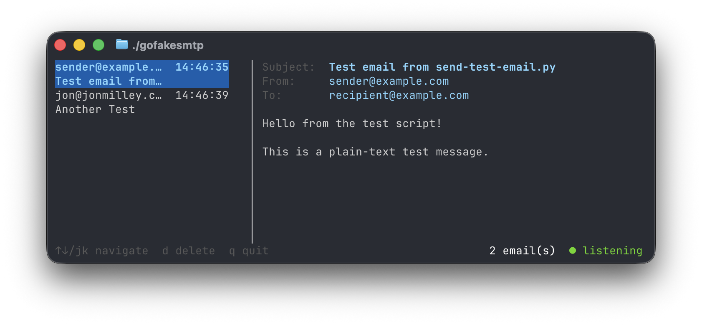

# gofakesmtp

A fake SMTP server with a terminal UI for testing email in applications. A Go equivalent of [FakeSMTP](https://nilhcem.com/FakeSMTP/).

Run it locally, point your app at `localhost:2525`, and watch emails appear in real time — no mail server, no credentials, nothing sent.



## Features

- Intercepts all SMTP email sent to a local port
- Terminal UI with split-pane layout: email list + message preview
- Keyboard navigation
- Optional auto-save to `.eml` files on disk
- STARTTLS support for apps that require TLS
- Optional AUTH PLAIN with a fixed username/password, or a permissive mode that accepts any credentials
- Optional full SMTP wire-session log to a file

## Install

```bash
go install github.com/jonmilley/gofakesmtp@latest
```

Or build from source:

```bash
git clone https://github.com/jonmilley/gofakesmtp
cd gofakesmtp
go build -o gofakesmtp .
```

## Usage

```bash
gofakesmtp [flags]
```

Start with defaults (listens on `127.0.0.1:2525`):

```bash
gofakesmtp
```

Custom port:

```bash
gofakesmtp --port 1025
```

Save all received emails to disk as `.eml` files:

```bash
gofakesmtp --output-dir ./received-emails
```

Enable STARTTLS (requires a TLS certificate and key):

```bash
gofakesmtp --tls-cert cert.pem --tls-key key.pem
```

Require AUTH PLAIN with a fixed username/password:

```bash
gofakesmtp --smtp-user alice --smtp-pass s3cret
```

Advertise AUTH PLAIN and accept any credentials (useful for clients that insist on authenticating):

```bash
gofakesmtp --smtp-auth-any
```

Append the full SMTP wire dialogue (including AUTH exchanges) to a log file:

```bash
gofakesmtp --session-log ./smtp-session.log
```

### All flags

| Flag | Short | Default | Description |
|------|-------|---------|-------------|
| `--port` | `-p` | `2525` | SMTP port to listen on |
| `--addr` | `-a` | `127.0.0.1` | Address to bind to |
| `--output-dir` | `-o` | _(none)_ | Directory to auto-save emails as `.eml` files |
| `--tls-cert` | | _(none)_ | TLS certificate file (enables STARTTLS) |
| `--tls-key` | | _(none)_ | TLS private key file (enables STARTTLS) |
| `--smtp-user` | | _(none)_ | Username for AUTH PLAIN; pair with `--smtp-pass` to require auth |
| `--smtp-pass` | | _(none)_ | Password for AUTH PLAIN; pair with `--smtp-user` to require auth |
| `--smtp-auth-any` | | `false` | Advertise AUTH PLAIN and accept any credentials (mutually exclusive with `--smtp-user`/`--smtp-pass`) |
| `--session-log` | | _(none)_ | File path to append the full SMTP wire-session log |

## Keyboard shortcuts

| Key | Action |
|-----|--------|
| `↑` / `k` | Move up |
| `↓` / `j` | Move down |
| `d` | Delete selected email |
| `l` | Open the session log viewer (only shown when `--session-log` is set) |
| `q` / `Ctrl+C` | Quit |

In the session log viewer:

| Key | Action |
|-----|--------|
| `↑↓` / `j` `k` | Scroll one line |
| `PgUp` / `PgDn` (also `b` / `f`) | Page up/down |
| `g` / `G` | Jump to top / bottom |
| `r` | Refresh now (auto-refreshes once per second; re-pins to tail) |
| `l` / `Esc` | Close, return to email view |
| `q` / `Ctrl+C` | Quit |

## Configuring your app

Point your app's SMTP settings at:

- **Host:** `127.0.0.1`
- **Port:** `2525` (or whatever you set with `--port`)
- **Auth:** none required by default; if `--smtp-user`/`--smtp-pass` are set, use AUTH PLAIN with those credentials; if `--smtp-auth-any` is set, AUTH PLAIN is advertised and any credentials are accepted
- **TLS:** off by default (use `--tls-cert`/`--tls-key` to enable STARTTLS)

### Example: Go `net/smtp`

```go
smtp.SendMail("127.0.0.1:2525", nil, "from@example.com", []string{"to@example.com"}, msg)
```

### Example: Nodemailer

```js
const transporter = nodemailer.createTransport({ host: "127.0.0.1", port: 2525, secure: false });
```

### Example: Python `smtplib`

See [send-test-email.py](/scripts/send-test-email.py) for example using smtplib

```python
with smtplib.SMTP("127.0.0.1", 2525) as s:
    s.sendmail("from@example.com", ["to@example.com"], msg)
```

## License

MIT
